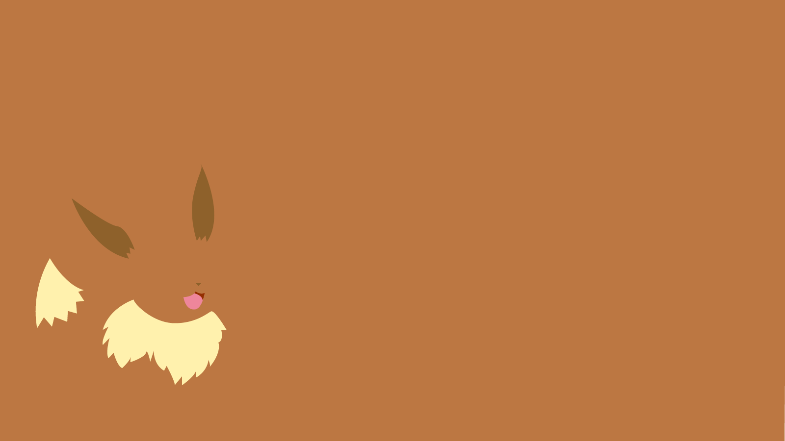

====================================
The アート of Community
====================================

:著者: Masato

内容
====

コミュニティ運営について幅広くかかれた本。 おせんべいおいしかったです。

* This is a bulleted list.
* こんな感じになります。

        * with a nested list
        * and some subitems

1. This is a numbered list.
2. It has two items.

#. This is a numbered list too.
#. You know that.

| There lines are
| broken exactly like in
| the source file.

This is a normal text paragraph. The next paragraph is a code sample ::

        It is not processed in any way, except 
        that the indentation is removed.

        It can span multiple lines.

This is a normal text paragraph again.
=====   ======   ========
A       B        A and B
=====   ======   ========
False   False    False
True    False    False
=====   ======   ========

google-> `google <http://www.google.com>`_

Lorem ipsum [#f1]_ dolor sit amet ... [#f2]_
.. rubric:: Footnotes

.. [#f1] Text of the first foot note.
.. [#f2] Text of the second foot note.

Tukuchare

summary
=======

hello.

How to say hello.
-----------------

greeting.

avoiding greeting.
^^^^^^^^^^^^^^^^^^^^

wat happened to him.

