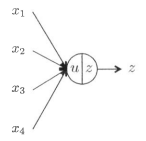
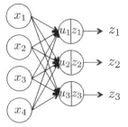

====================================
機械学習のまとめ
====================================

:著者: Masato

概要
====================================
機械学習に必要な知識についてまとめてあります。参考文献葉は

#. Christopher M. Bishop "Pattern Recognition and Machine Learning"
#. 機械学習プロフェッショナルシリーズ
#. 人工知能学会「深層学習」 

からまとめています。現在は深層学習に向けた知識をまとめるので、主に取り扱っているのはニューラルネットワークです。

機械学習とは
====================================

確率分布
====================================

線形回帰モデル
====================================

線形識別モデル
====================================

ニューラルネットワーク
====================================

.. math:: (a + b)^2 = a^2 + 2ab + b^2

          (a - b)^2 = a^2 - 2ab + b^2

          \bm{A}

順伝搬型ネットワーク
-------------------------------------

ユニットの出力
^^^^^^^^^^^^^^^^^^^^^^^^^^^^^^^^^^^^^
 順伝搬型ネットワーク(feedforward neural network)は、層状に並べたユニットが隣接層間でのみ結合した構造を持ち、情報が入力側から出力側に一方向にのみ伝搬するニューラルネットワークである。文権によっては、
 多層パーセプトロン(Multi-layer Perceptron)と呼ばれる。
 　ネットワークを構成するユニットは、複数の入力を受け取り、1つの出力を計算します。例えば、4つの入力 :math:`x_{1}, x_{2}, x_{3} , x_{4}` を受け取った場合の総入力 `u` は、

.. math:: u = w_{1}x_{1} + w_{2}x_{2} +  w_{3}x_{3} +  w_{4}x_{4} + b

のように各入力にそれぞれ異なる値の重み(weight) :math:`w_{1}, w_{2}, w_{3} , w_{4}` を掛けた値を加算し、これにバイアス(bias)を足し合わせたものになる。ユニットの出力 :math:`z` は、総入力 :math:`u` に対する活性化関数
(activation function)と呼ばれる関数 :math:`f` の出力となる。

.. math:: z = f(u)

順伝搬型ネットワークでは、下図のようになり、このようなユニットが層状に並べられ、層間でのみ結合を持つ。前段の層のユニットの出力が後段の層のユニットの出力になるという形で、この結合を通じて信号は前から後ろに一方向に伝搬する。
同図のネットワークでは、後段の3つのユニット( :math:`j = 1,2,3` )はそれぞれ、前段の層の4つのユニット( :math:`i = 1,2,3,4` )からの出力 :math:`x_1, x_2, x_3, x_4` を入力として受け取る。ユニットの結合は3x4=12本ありが、
その1つ1つの結合に異なる重み :math:`w_{ji}` が与えられている。次式は3つのユニットが受け取る入力はそれぞれ、

.. math:: u_1 = w_{11}x_{1} + w_{12}x_{2} +  w_{13}x_{3} +  w_{14}x_{4} + b_1

          u_2 = w_{21}x_{1} + w_{22}x_{2} +  w_{23}x_{3} +  w_{24}x_{4} + b_2

          u_3 = w_{31}x_{1} + w_{32}x_{2} +  w_{33}x_{3} +  w_{34}x_{4} + b_3

で計算され、これらに活性化関数を適用したものが出力となる。

.. math:: z_j = f(u_j) (j = 1,2,3)

第1層のユニットを :math:`i = 1, ..., I,` 
第2層のユニットを :math:`j = 1, ..., J,` で表すと、
第1層のユニットの出力から第2層のユニットへの出力が決まるまでの計算は次の様になる。 :math:`( j = 1, ..., J )` .

.. math:: u_j = \sum_{i=1}^n w_{ji}x_{i} + b_j

          z_j = f(u_j)

ベクトル化すると、

.. math:: \vector[u] = \vector[Wx] + \vector[b]

          \vector[z] = f(\vector[u])
            

確率的勾配降下法
-------------------------------------

誤差逆伝搬
-------------------------------------

事前学習(自己符号化器)
-------------------------------------

AutoEncoder
^^^^^^^^^^^^^^^^^^^^^^^^^^^^^^^^^^^^^
AutoEncoder(AE)は、出力データが入力データをそのまま再現する3層のNNである。そのため、入力層から中間層への変換はエンコード、中間層から出力層への変換はデコードと呼ばれる。中間層のノード数は入力データの次元数以上だと、
エンコードが恒等関数になるので、中間層のノード数は入力データの次元よりも小さくする。つまり、中間層の出力は入力データを次元圧縮したものと表現している。

chainerによるIrisデータセットの次元圧縮のコードがこちら ::
    
    import numpy as np
    import chainer
    from chainer import cuda, Function, gradient_check, Variable, optimizers, serializers, utils
    from chainer import Link, Chain, ChainList
    import chainer.functions as F
    import chainer.links as L
    from sklearn import datasets
    
    iris = datasets.load_iris()
    xtrain = iris.data.astype(np.float32)
    
    class MyAE(Chain):
        def __init__(self):
            super(MyAE, self).__init__(
                l1 = L.Linear(4,2),
                l2 = L.Linear(2,4),
            )
        def __call__(self,x):
            bv = self.fwd(x)
            return F.mean_squared_error(bv, x)
        def fwd(self, x):
            fv = F.sigmoid(self.l1(x))
            bv = self.l2(fv)
            return bv
    
    model = MyAE()
    optimizer = optimizers.SGD()
    optimizer.setup(model)
    
    n = 150
    bs = 30
    for j in range(300):
        sffindx = np.random.permutation(n)
        for i in range(0, n ,bs):
            x = Variable(xtrain[sffindx[i:(i+bs) if (i + bs) < n else n]])
            model.zerograds()
            loss = model(x)
            loss.backward()
            optimizer.update()
    
    import matplotlib.pyplot as plt
    x = Variable(xtrain)
    yt = F.sigmoid(model.l1(x))
    ans = yt.data
    ansx1 = ans[0:50,0]
    ansy1 = ans[0:50,1]
    ansx2 = ans[50:100,0]
    ansy2 = ans[50:100,1]
    ansx3 = ans[100:150,0]
    ansy3 = ans[100:150,1]
    
    plt.scatter(ansx1,ansy1,marker="^")
    plt.scatter(ansx2,ansy2,marker="o")
    plt.scatter(ansx3,ansy3,marker="+")
    plt.show()

これでは、ChainクラスのMyAEの損失関数の部分で教師信号が入力信号が入力データ `x` になっているのがポイントである。

AutoEncoder
^^^^^^^^^^^^^^^^^^^^^^^^^^^^^^^^^^^^^
AEでは中間層のノード数が入力信号のノード数（入力ベクトルの次元数）よりも多いと恒等関数になってしまう問題があり、次元圧縮として使うなら問題はないが、次元悪sy区とは逆に入力ベクトルを
より高次元の空間に射影したい場合は使うことができない。SVMのように高次元空間に射影し、その空間では識別が線形で行えるなどの利点を求める場合、Denoising AutoEncoder(DAE)を用いることで、
高次元に射影することも可能である。また、高次元への射影ではなく、通常の次元圧縮にもDAEを使うことができ、AEの改良版となる。しかし、理論的に示すのは難しい。
ノイズを入れることで確認出来る。
https://github.com/bohemian916/deeplearning_tool/blob/master/increase_picture.py

畳み込みニューラルネット
-------------------------------------

画像認識
^^^^^^^^^^^^^^^^^^^^^^^^^^^^^^^^^^^^^

再帰型ニューラルネット
-------------------------------------

音声認識
^^^^^^^^^^^^^^^^^^^^^^^^^^^^^^^^^^^^^

自然言語処理
^^^^^^^^^^^^^^^^^^^^^^^^^^^^^^^^^^^^^

ボルツマンマシン
-------------------------------------

カーネル法
====================================

疎な解を持つカーネルマシン
====================================

グラフィカルモデル
====================================

混合モデルとEM
====================================

近似推論法
====================================

サンプリング法
====================================
ここではマルコフ連鎖モンテカルロ法などについて述べられる。

連続潜在変数
====================================

系列データ
====================================

モデルの結合
====================================

実践
=====================================

Caffeの使い方
-------------------------------------
ネットワークの基本的な攻勢はlayerを作成し、それらをblobと命名して結合していく。このlayerの作成とblobの結合は、prototxtという設定ファイルに記述していく。Caffeによる学習と評価には、3つのファイルが必要である。

* train_test.prototxt       : ネットワーク攻勢と学習データセット
* solver.prototxt           : 学習パラメータ
* deploy.prototxt           : 入力データ情報とネットワーク構成

これらの名前は上記と同じなくていい。

https://gist.github.com/rezoo/a1c8d1459b222fc5658f
構築方法(AMI)
http://jnory.hatenablog.com/entry/archives/137

データ拡張
-------------------------------------
今あるサンプルをもとにバリエーションを増やして枚数を増やすデータ拡張デス。データ拡張は、サンプルに対して平行移動や回転変動を加えたり、鏡面反転させたりして、返歌を加えたサンプルを作成する方法です。
加える変化は上記以外にも、ランダムノイズやボケを加えることもある。平行移動や回転変動を加える場合、対象とするサンプルによって画像外はにはみ出すこともある。
手書き文字認識などのように、形状変化が生じる問題を対象賭する場合、形状に変形を加えてデータ拡張することもある。形状変化させる方法としては、弾性変形(elastic distortion)がある。
[P. Y. Simard, D.Steinkraus, and J. C. Platt. Best practices for convolutional neural networks applied to visual document analysis. In International Conference on Document Analysis and Recognition(ICDAR), pp.958-962,2003.]
弾性変形は、バイナリニアやバイキューブの補間方法を利用する。

前処理
-------------------------------------
入力データから特徴変換せず、入力データをそのまま与えるのがディープラーニングでは一般的である。しかし、クラス内の変動が大きい場合は、変動を少しでも抑えるような前処理をすることが多い。前処理の代表例としては以下のものがある。

* 平均値除去
* 正規化
* 白色化

平均値除去
^^^^^^^^^^^^^^^^^^^^^^^^^^^^^^^^^^^^^^
平均値除去は大規模な一般物体認識で用いられる方法であり、学習する画像すべての平均画像を以下のように求める。

学習サンプルは平均画像を引いた差分画像xを入力データとする。
これにより、各要素の平均が0になるようにし、全体的に明るさの変動を抑えた様な画像になっている。

正規化
^^^^^^^^^^^^^^^^^^^^^^^^^^^^^^^^^^^^^^
正規化(normalization)は、各サンプルの平均と分散を合わせる前処理です。平均値除去は各要素の平均が0になるようにしているが、正規化ではさらに各要素のばらつきを合わせるように分散を1にする。
まず、各要素の標準偏差 :math:`\sigma_i` を求める。

平均値除去の後、求めた標準偏差で割る。
これにより、各要素が平均0、分散1になる。平均値除去を行った場合よりも画像間の明るさのばらつきが小さくなる。

白色化
^^^^^^^^^^^^^^^^^^^^^^^^^^^^^^^^^^^^^^
白色化(whitening)は、要素間の相関をなくす方法である。これにより、相関の低い要素の情報が残り、画像の場合は、エッジが強調されたような画像になる。まず、平均値を行い、平均が0になるようにする。これを

すべての学習サンプルについて、平均が0になるようにしたら、それを

正規化処理とゼロ位相白色化を行ったものは、直流成分のような相関の高い画素の情報は消え、相関の低い画素、すなわちエッジ成分が残っている。特徴的な画像にすることによって認識性能を向上させることが出来る。

活性化関数
-------------------------------------
ニューラルネットワークでは活性化関数としてシグモイド関数が主に利用されていたが、ディープラーニングでReLUが提案されて以降、新たな活性化関数やReLUの派生が提案されている。

* マックスアウト
* Leaky ReLU
* Parametric ReLU(PReLU)
* Randomized leaky Rectified Linear Units (RReLU)

マックスアウト
^^^^^^^^^^^^^^^^^^^^^^^^^^^^^^^^^^^^^^

